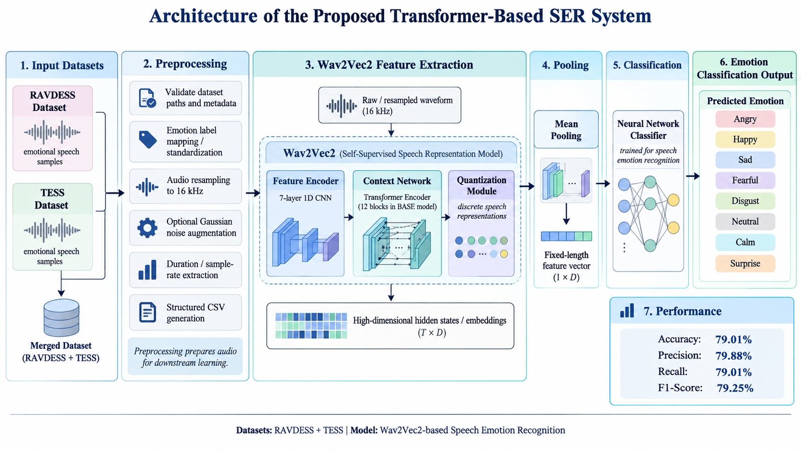
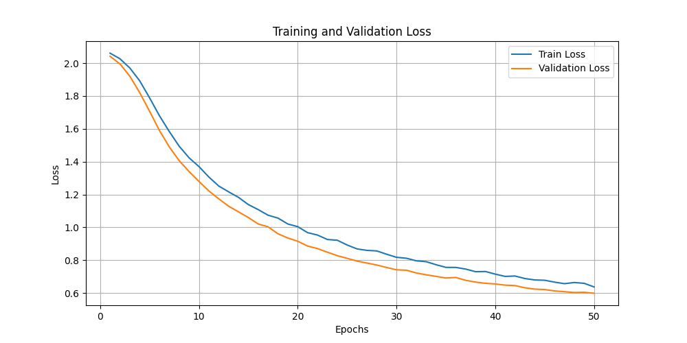
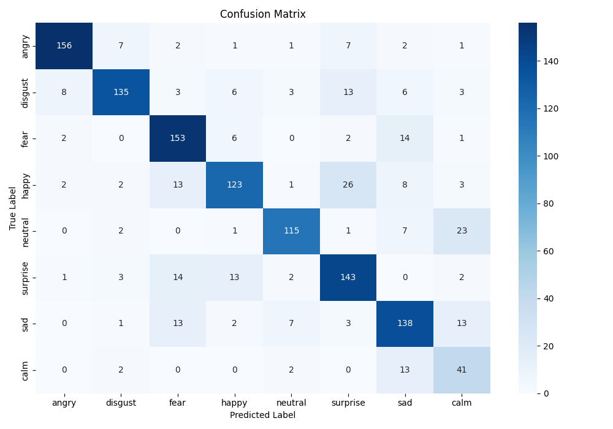
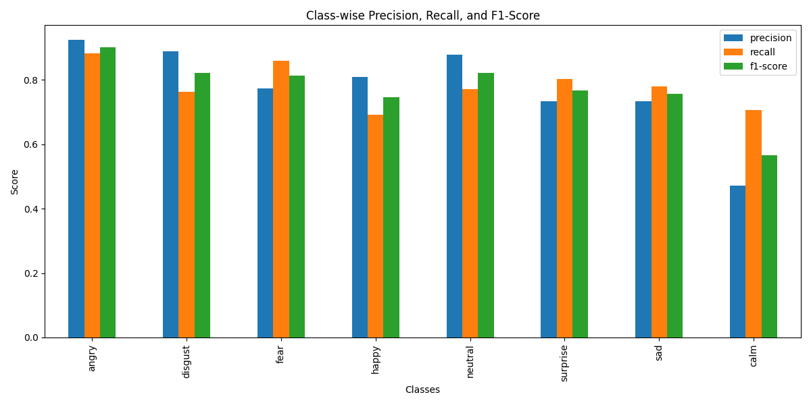

# Vocal Sentiments: Transformer Based Speech Emotion Recognition

This repository contains the speech emotion recognition pipeline and the
**VocalSense** Flask demo associated with the paper below. The current code uses
pretrained Wav2Vec2 embeddings and a PyTorch MLP to classify eight emotions:
angry, calm, disgust, fear, happy, neutral, sad, and surprise.

## Research paper

**Didar Ali, Muhammad Shahab, Yasir Saleem Afridi, and Rehmat Ullah.**
*Vocal Sentiments: Transformer Based Speech Emotion Recognition.*
VFAST Transactions on Software Engineering, **13**(3), 187-197, 2025.
Published September 27, 2025.

[Read the paper](https://vfast.org/journals/index.php/VTSE/article/view/2174)
| [DOI: 10.21015/vtse.v13i3.2174](https://doi.org/10.21015/vtse.v13i3.2174)

The study investigates transfer learning with Wav2Vec2 speech representations
on combined RAVDESS and TESS data and examines noise robustness. It reports
**79.01% accuracy**. See the [publication](https://doi.org/10.21015/vtse.v13i3.2174)
for the research findings; the local results and reproducibility limits are
listed separately below.

## Proposed architecture



The diagram illustrates the proposed research workflow and its reported metrics.
In the current code, classification uses mean-pooled Wav2Vec2 hidden states;
the quantization module is part of Wav2Vec2 pretraining, not the inference path.
The optional noise augmentation shown is not persisted by the current pipeline.
See [Results and reproducibility](#results-and-reproducibility) for local results.

## Current implementation


The Transformer is the Wav2Vec2 feature extractor. The classification head is a
feed-forward neural network with ReLU and dropout. The current training script
optimizes the classifier on saved embeddings; it does not fine-tune Wav2Vec2.
Training uses Adam, a learning rate of `0.0001`, batch size `32`, and `50` epochs.

The web demo adds audio preview, a waveform, emotion probabilities, an uncertainty
indicator, and recent prediction history. These are repository features, not
additional experimental results from the paper.

## Results and reproducibility

| Source | Accuracy | Interpretation |
| --- | --- | --- |
| [Published paper](https://doi.org/10.21015/vtse.v13i3.2174) | 79.01% | Reported research result. |
| Local `results/test_metrics.csv` | 78.93% | Saved result from the current evaluation pipeline; its split is reused from validation. |

The local metric does not exactly reproduce the published accuracy. The current
scripts also do not reproduce the paper's noise study: `--add_noise` modifies an
in-memory waveform that is not saved for feature extraction. See
[Current evaluation limitations](#current-evaluation-limitations) before interpreting
these artifacts as independent test or noise-robustness results.

### Repository plots

These images are generated by the local pipeline and are included in Git.
They are not extracted figures from the publication.







## Setup

Use Python 3.11 for the pinned dependencies (the locally tested Python version).
From the project root, run these commands in PowerShell:

```powershell
python -m venv .venv
.\.venv\Scripts\Activate.ps1
python -m pip install -r requirements.txt
```

On macOS/Linux, activate with `source .venv/bin/activate` instead.
PyTorch selects CUDA when available and otherwise uses the CPU.

## Run the web app

With the environment activated, run from the project root:

```powershell
python scripts/app.py
```

Or, if already inside `scripts/`, run `python app.py`.
Open http://127.0.0.1:5000. Stop the server with Ctrl+C and restart it after code
changes; automatic reloading is disabled.

The app requires these local files:

- `models/emotion_classifier/emotion_classifier.pth`
- `extracted_features/combined_wav2vec_features.csv`

The original trainer saves only the model weights. The app recovers class names
in their original first-appearance order from the training feature CSV, using
the same missing-row filtering as training. Keep that CSV unchanged and paired
with its checkpoint. Alternatively, supply `label_names.npy` in the model folder
as a one-dimensional Unicode array in the exact training class order.
Do not alphabetically sort the labels.

The classifier uses 768 input features and hidden layers of 128 and 64 units.
It does not use feature scaling, so no `feature_scaler.pkl` or `model_info.json`
is required. Model metadata is constructed by the loader.

The first prediction loads `facebook/wav2vec2-base`; internet access is required
if the Hugging Face model is not already cached. Later requests reuse the loaded
models. The page also loads Chart.js and fonts from external services.

Supported uploads are WAV, MP3, FLAC, and OGG. Audio must be at least 0.1 seconds
and at most 30 seconds. The request limit is 10 MB, including multipart overhead.
Audio is resampled to 16 kHz mono on the server and temporary uploads are removed
after processing. The last 50 predictions are stored in
`results/inference_predictions.json`; the interface shows the newest 10.
Confidence below 40% is marked uncertain.

## Rebuild the training pipeline

Download and extract the datasets manually:

- [RAVDESS dataset](https://www.kaggle.com/datasets/uwrfkaggler/ravdess-emotional-speech-audio)
- [TESS dataset](https://www.kaggle.com/datasets/ejlok1/toronto-emotional-speech-set-tess)

Use this directory layout:

```text
data/
  ravdess/
    actor_01/
    ...
  tess/
    tess_toronto_emotional_speech_set_data/
      oaf_angry/
      ...
```

Run the pipeline from the project root. Default paths are anchored to the project
folder, so running the scripts from `scripts/` also works. Project folders use
lowercase `snake_case`. Metadata audio paths are relative to the project root;
external dataset paths are stored as absolute paths. Explicit relative CLI paths
are interpreted from your current working directory.

```powershell
python scripts/preprocess.py
python scripts/wav2vec_feature_extraction.py
python scripts/train_emotion_classifier.py
python scripts/test_emotion_classifier.py
```

Run each command after the previous command finishes. Plot windows may need to
be closed before the script continues. Training overwrites the existing classifier
checkpoint; keep its matching feature CSV if preserving an older model.

| Script | Purpose |
| --- | --- |
| `preprocess.py` | Index audio labels, paths, durations, and sample rates; create distribution plots. |
| `wav2vec_feature_extraction.py` | Extract mean-pooled Wav2Vec2 features into a CSV. |
| `train_emotion_classifier.py` | Train the MLP for 50 epochs and save weights and a loss plot. |
| `test_emotion_classifier.py` | Calculate metrics and save predictions and evaluation plots. |
| `model.py` | Load the existing classifier and recover its class labels for inference. |
| `app.py` | Serve the web interface and prediction endpoints. |

### Current evaluation limitations

The evaluation script recreates the same 30% split used for validation during
training. Its results are validation metrics, not an independent held-out test.
Splitting is by recording rather than speaker, so it does not establish performance
on unseen speakers. The saved accuracy is approximately 78.93% on that split.

The preprocessing `--add_noise` option currently does not persist augmented audio;
feature extraction still reads the original recordings. It should not be treated
as training augmentation.

## Project structure

```text
project_root/
  scripts/
    app.py
    model.py
    preprocess.py
    wav2vec_feature_extraction.py
    train_emotion_classifier.py
    test_emotion_classifier.py
    templates/index.html
    static/
      professional.js
      professional.css
      styles.css
      favicon.svg
  data/
  preprocessed_data/
  extracted_features/
  models/emotion_classifier/
  results/
  deployment/uploads/
  requirements.txt
  README.md
  .gitignore
```

Both CSS files are currently loaded by the template. `professional.js` is the
active frontend script.

## Git and local artifacts

`.gitignore` includes images and Markdown documentation in the data, preprocessing,
feature, model, and result folders. Short README files preserve the folder layout
in Git. Audio, CSVs, model binaries, runtime history, virtual environments, caches,
uploads, logs, and local configuration remain ignored.
Ignored files remain on disk but are not included in new commits. A fresh clone
must restore the matching model and features or run the pipeline before inference.
Ignore rules do not remove files already tracked by Git.

## Troubleshooting

- **Missing model or labels (503):** restore the checkpoint and its original feature
  CSV at the paths above, or provide the matching `label_names.npy`.
- **Pipeline cannot find files:** check the lowercase folder layout above.
  Regenerate metadata with `preprocess.py` after moving or renaming audio folders.
- **Audio cannot be decoded:** export a standard WAV file and try again.
- **Wav2Vec2 unused-weight messages:** the app loads the feature extractor rather
  than the pretraining heads. These messages alone do not mean prediction failed.

The bundled Flask server is intended for local development. It currently listens
on all network interfaces at port 5000, so other machines may reach it when the
firewall permits. Prediction history is shared by users of that server.

## Citation

If you reference the research, cite the published article:

```bibtex
@article{ali2025vocalsentiments,
  title   = {Vocal Sentiments: Transformer Based Speech Emotion Recognition},
  author  = {Ali, Didar and Shahab, Muhammad and Afridi, Yasir Saleem and Ullah, Rehmat},
  journal = {VFAST Transactions on Software Engineering},
  volume  = {13},
  number  = {3},
  pages   = {187--197},
  year    = {2025},
  doi     = {10.21015/vtse.v13i3.2174},
  url     = {https://vfast.org/journals/index.php/VTSE/article/view/2174}
}
```
